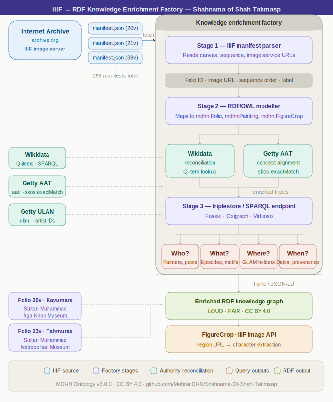
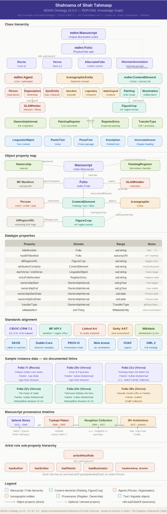
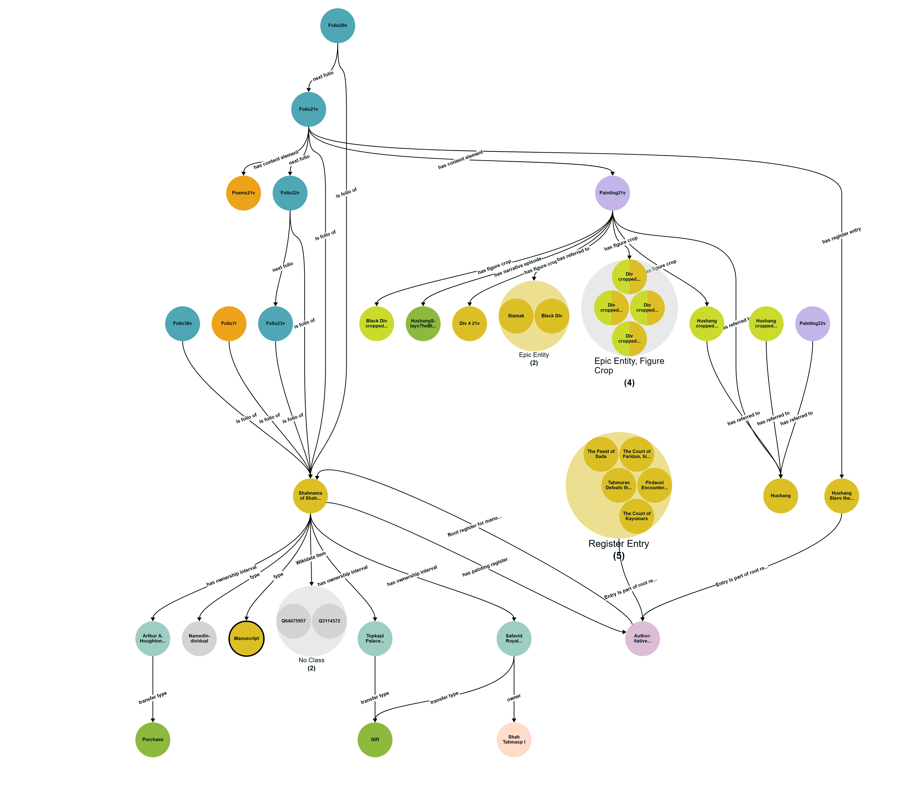

# شاهنامه شاه طهماسب — Shahnama of Shah Tahmasp
## RDF / OWL Knowledge Graph

> A LOUD & FAIR knowledge graph representing the **Shahnama of Shah Tahmasp** (c. 1522–1535 CE) — one of the most magnificent illustrated manuscripts in the history of Islamic art — modelled in OWL 2, aligned to CIDOC-CRM 7.1, Linked Art, IIIF Presentation API 3, and the Getty Vocabularies.

[](https://creativecommons.org/licenses/by/4.0/)
[](mdhn-starter_ontology.ttl)
[](https://iiif.io)
[](https://www.cidoc-crm.org/)

---

## Table of Contents

1. [Introduction](#introduction)
2. [The Manuscript](#the-manuscript)
3. [Project Goals & Design Principles](#project-goals--design-principles)
4. [Repository Structure](#repository-structure)
5. [Ontology Walkthrough](#ontology-walkthrough)
   - [Namespace Architecture](#namespace-architecture)
   - [Core Classes](#core-classes)
   - [Object Properties](#object-properties)
   - [Datatype Properties](#datatype-properties)
   - [Standards Alignment](#standards-alignment)
6. [Integrating Family History Knowledge Base (FHKB)](#integrating-family-history-knowledge-base-fhkb) 
   - [Integration Architecture](#integration-architecture)
   - [Classes and Properties mappings](#class-and-property-mappings)
   - [Example of the mythological dynasty](#integration-example--the-mythological-dynasty-turtle)
   - [SPARQL Queries](#sparql-queries--genealogy-aware)   
7. [Sample Data Overview](#sample-data-overview)
8. [SPARQL Query Examples](#sparql-query-examples)
9. [Getting Started](#getting-started)
10. [Contributing](#contributing)
11. [Citation](#citation)
12. [License](#license)

---

## Introduction

The **Shahnama of Shah Tahmasp** also known as the Houghton Shahnameh is a royal Persian manuscript produced between approximately 1522 and 1535 CE at the Safavid court in Tabriz under the patronage of Shah Tahmasp I. It is widely regarded as the most ambitious illustrated book ever made, containing **268 full-page paintings** by the greatest masters of the Persian painterly tradition, including Sultan Muhammad, Āqā Mīrak, Qadimi, and many others. The text is the *Shahnameh* ("Book of Kings"), the Persian national epic composed by the poet Ferdowsi (c. 977–1010 CE).

The manuscript's subsequent history is as remarkable as its creation. Gifted to Ottoman Sultan Selim II in 1568, it was held in the Topkapı Palace Library for nearly four centuries before passing into the hands of American collector Arthur A. Houghton Jr. in 1959. Houghton eventually dispersed the manuscript, donating a portion of folios to the Metropolitan Museum of Art and selling the remainder, resulting in the manuscript's current state: **dispersed across 30+ institutions and private collections** worldwide.

This repository provides a **Linked Open Usable Data (LOUD)** and **FAIR**-compliant knowledge graph of the manuscript. It encodes the physical object, its folios, paintings, illuminations, textual content, iconographic entities, narrative episodes, legendary characters, and provenance history in a machine-readable, interoperable RDF/OWL format.

 


---

## The Manuscript

| Attribute | Detail |
|---|---|
| **Title** | Shahnama of Shah Tahmasp (*شاهنامه شاه طهماسب*) |
| **Also known as** | The Houghton Shahnameh |
| **Produced** | c. 1522–1535 CE |
| **Origin** | Tabriz, Safavid Persia |
| **Text** | *Shahnameh* by Ferdowsi |
| **Paintings** | 268 full-page illustrations |
| **Current status** | Dispersed across 30+ collections globally |
| **Wikidata** | [Q3114572](https://www.wikidata.org/wiki/Q3114572), [Q64675957](https://www.wikidata.org/wiki/Q64675957) |

**Key holding institutions include:** Metropolitan Museum of Art (New York), Aga Khan Museum (Toronto), Tehran Museum of Contemporary Art, Khalili Collection (London), Cincinnati Art Museum, and numerous private collections.

**Primary reference:** Dickson, Martin B. and Welch, Stuart Cary. *The Houghton Shahnameh*. Harvard University Press, 1981.

---

## Project Goals & Design Principles

- **LOUD** — Linked Open Usable Data: the graph is usable out of the box by researchers without requiring deep RDF expertise.
- **FAIR** — Findable, Accessible, Interoperable, Reusable: every resource carries globally unique IRIs and is cross-linked to authority files (Wikidata, Getty AAT/TGN/ULAN).
- **IIIF-native** — Every folio and painting resource carries a IIIF Presentation API 3 Manifest URI, enabling integration with any IIIF-compliant viewer.
- **CIDOC-CRM aligned** — Core classes and properties are aligned to the CIDOC-CRM 7.1 museum standard, ensuring interoperability with cultural heritage data ecosystems.
- **Bilingual** — All `rdfs:label` values are provided in both English (`@en`) and Persian/Farsi (`@fa`).
- **Provenance-aware** — Manuscript ownership history is modelled at granular detail including transfer type, dates, and agents.
- **FHKB (Family History Knowledge Base)** — formal OWL encoding of the *Shahnameh*'s dynastic genealogies

---

## Repository Structure

```
.
├── mdhn-starter_ontology.ttl   # OWL 2 ontology (v3.0.0)
├── resources.ttl               # Sample instance data (folios 7r, 20v, 21v, 22v, 23v, 38v)
└── README.md                   # This file
```

---

The ongoing process of uploading the folios to the Internet Archive is mandatory. The Internet Archive (IA) serves as a unified, IIIF-compliant repository that integrates all available digital representations of the folios, including alternative versions. As a result, a single folio may have multiple representations, with the highest-resolution version selected as the primary one.
[Images repository of folios in Internet Archive](https://archive.org/search?query=genre%3A%22Shahnama+Shah+Tahmasp%22&sort=title)

## Ontology Walkthrough

**Ontology IRI:** `http://example.com/mdhn/ontology`  
**Version:** 3.0.0  
**Prefix:** `mdhn:` → `http://example.com/mdhn/ontology#`


### Namespace Architecture

The ontology uses a carefully structured set of prefixes that separate the **schema** (`mdhn:`) from **resource instances** (a family of `mdhnr:` sub-prefixes). This design keeps local names short, readable, and non-colliding:

| Prefix | Base IRI | Purpose |
|---|---|---|
| `mdhn:` | `http://example.com/mdhn/ontology#` | OWL classes and properties |
| `mdhnr:` | `http://example.com/mdhn/resource/` | Root resource namespace |
| `folio:` | `.../resource/folio/` | Folio instances (e.g. `folio:20v`) |
| `painting:` | `.../resource/painting/` | Painting instances |
| `episode:` | `.../resource/episode/` | Narrative episode instances |
| `character:` | `.../resource/character/` | Epic character instances |
| `crop:` | `.../resource/crop/` | Figure crop instances |
| `agent:` | `.../resource/agent/` | Person and organisation instances |
| `register:` | `.../resource/register/` | Painting register instances |
| `entry:` | `.../resource/entry/` | Register entry instances |

**URI convention:** Hierarchy in the IRI path uses `/`; compound local names use `_` exclusively (never `-` or camelCase breaks), following the CIDOC-CRM convention (e.g. `E22_Human-Made_Object`).

---

### Core Classes

#### `mdhn:Manuscript`
The top-level physical object, a unique illuminated codex. Aligned to Getty AAT `aat:300028569`. There is one named individual of this class: `mdhn:manuscript_shahnama_shah_tahmasp`.

#### `mdhn:Folio` and its Subclasses
A physical folio (recto or verso), modelled as an independent resource. The `mdhn:Folio` class has four subclasses:

- **`mdhn:Recto`** — The front (right-hand) side of a leaf, labelled `r`.
- **`mdhn:Verso`** — The back (left-hand) side of a leaf, labelled `v`.
- **`mdhn:AlternateFolio`** — A replacement or variant version of a canonical folio position.
- **`mdhn:OttomanAnnotationLeaf`** — A separate leaf attached during the Ottoman period bearing handwritten annotations.

All folio subclasses carry `mdhn:hasIIIFManifest` and can be linked to a GLAM holder via `mdhn:keptIn`.

#### `mdhn:ContentElement` and its Subclasses
Any intellectual or artistic unit carried on a folio side. Subclasses include:

- **`mdhn:Painting`** — A full-page or partial painted illustration. Also a subclass of `crm:E36_Visual_Item`. Aligned to `aat:300033799`.
- **`mdhn:Illumination`** — Decorative gilded illumination. Aligned to `aat:300053433`.
- **`mdhn:LinguisticObject`** — Any text content on a folio.
- **`mdhn:IlluminatedUnwan`** — A chapter-heading illumination in the manuscript's opening pages.
- **`mdhn:Shamseh`** — A medallion-shaped decorative element.
- **`mdhn:Inscription`** — A text inscription appearing within a painting.

#### `mdhn:FigureCrop`
A subclass of `mdhn:Painting` representing a cropped region extracted from a high-resolution IIIF image, isolating a specific character, creature, or depicted object. Each crop carries a `mdhn:iiifRegionURL` (a full IIIF Image API URL with region parameter) enabling direct image retrieval. Crops are linked back to their source painting via `mdhn:isExtractedFrom`.

#### `mdhn:IconographicEntity` and its Subclasses
A concept depicted in a painting — a character, episode, motif, or symbolic element. Subclasses:

- **`mdhn:NarrativeEpisode`** — A specific episode from the Shahnameh narrative.
- **`mdhn:LegendaryCharacter`** — A fictional or legendary character from the epic tradition.
- **`mdhn:HistoricalFigure`** — A real, documentable historical person.
- **`mdhn:MythologicalCreature`** — A supernatural being such as a *div* (demon), *simurgh* (phoenix), or dragon.

#### `mdhn:Agent`, `mdhn:Person`, `mdhn:Organization`, `mdhn:EpicEntity`
The agent hierarchy models all actors in the manuscript's creation, ownership, and narration. `mdhn:EpicEntity` specifically models characters *from the epic poem itself* (e.g. Keyumars, Hushang, Faridun) as agents who appear in paintings — distinct from `mdhn:Person`, which models real historical individuals such as the painters, calligraphers, and patrons.

#### `mdhn:GLAMHolder`
A gallery, library, archive, or museum (GLAM) institution that currently holds one or more folios. A subclass of `mdhn:Organization`.

#### `mdhn:PaintingRegister` and `mdhn:RegisterEntry`
The `mdhn:PaintingRegister` is the authoritative checklist of all 268 paintings of the manuscript, associated to the `mdhn:Manuscript` resource. Each `mdhn:RegisterEntry` corresponds to a single expected painting — carrying its folio number, title, and description from the scholarly register. The presence or absence of a `mdhn:linkedPainting` link on a register entry signals whether a painting has been located and digitised or remains missing and unaccounted for.

#### `mdhn:OwnershipInterval`
A period during which a specific agent held ownership of the manuscript or a dispersed folio. A subclass of `crm:E8_Acquisition`. Carries `mdhn:ownershipStart`, `mdhn:ownershipEnd`, `mdhn:owner`, and `mdhn:transferType` properties.

---

### Object Properties

| Property | Domain | Range | Description |
|---|---|---|---|
| `mdhn:hasFolio` | `Manuscript` | `Folio` | Links manuscript to its folios |
| `mdhn:isFolioOf` | `Folio` | `Manuscript` | Inverse of `hasFolio` |
| `mdhn:hasContentElement` | `Folio` | `ContentElement` | Links folio to its content units |
| `mdhn:elementBelongsTo` | `ContentElement` | `Folio` | Inverse of `hasContentElement` |
| `mdhn:hasPainter` | `ContentElement` | `Person` | Attributes a painting to an artist |
| `mdhn:hasWorkshop_director` | `ContentElement` | `Person` | Records the workshop director |
| `mdhn:hasScriber` | `ContentElement` | `Person` | Records the calligrapher |
| `mdhn:hasIlluminator` | `ContentElement` | `Person` | Records the illuminator |
| `mdhn:hasAuthor` | `ContentElement` | `Person` | Records the poet/author |
| `mdhn:depicts` | `Painting` | `IconographicEntity` | Links painting to depicted entities |
| `mdhn:hasNarrativeEpisode` | `Painting` | `NarrativeEpisode` | Sub-property of `depicts` for episodes |
| `mdhn:hasReferredTo` | `Painting` | `EpicEntity` | Sub-property of `depicts` for characters |
| `mdhn:hasFigureCrop` | `Painting` | `FigureCrop` | Links painting to extracted figure crops |
| `mdhn:isExtractedFrom` | `FigureCrop` | `Painting` | Inverse of `hasFigureCrop` |
| `mdhn:representsEntity` | `FigureCrop` | `IconographicEntity` | The entity isolated by a crop |
| `mdhn:keptIn` | `Folio` | `GLAMHolder` | Current institutional location |
| `mdhn:hasOwnershipInterval` | `owl:Thing` | `OwnershipInterval` | Links to provenance records |
| `mdhn:owner` | `OwnershipInterval` | `Agent` | The owner during an interval |
| `mdhn:transferType` | `OwnershipInterval` | `TransferType` | How ownership was transferred |
| `mdhn:nextFolio` | `Folio` | `Folio` | Sequential folio ordering |
| `mdhn:previousFolio` | `Folio` | `Folio` | Inverse of `nextFolio` |
| `mdhn:hasPaintingRegister` | `Manuscript` | `PaintingRegister` | Links to the painting checklist |
| `mdhn:entryPartOf` | `RegisterEntry` | `PaintingRegister` | Links entry to its register |
| `mdhn:hasRegisterEntry` | `Folio` | `RegisterEntry` | Links folio to its register entry |
| `mdhn:hasSubEpisode` | `NarrativeEpisode` | `NarrativeEpisode` | Hierarchical episode nesting |
| `mdhn:anEpisodeOf` | `NarrativeEpisode` | `Manuscript` | Links episode to its manuscript |
| `mdhn:wikidataItem` | `owl:Thing` | `WikidataEntity` | Cross-reference to Wikidata |
| `mdhn:hasInscription` | `Painting` | `Inscription` | Links painting to inscriptions |

---

### Datatype Properties

| Property | Domain | Range | Description |
|---|---|---|---|
| `mdhn:folioNumber` | `Folio` | `xsd:string` | Canonical folio label, e.g. `"20v"` |
| `mdhn:iiifRegionURL` | `FigureCrop` | `xsd:string` | IIIF Image API region URL for the crop |
| `mdhn:hasIIIFManifest` | `Folio` | `xsd:anyURI` | IIIF Presentation API 3 manifest URI |
| `mdhn:attributionCertainty` | `ContentElement` | `xsd:string` | `"certain"`, `"probable"`, `"possible"`, `"disputed"`, or `"unknown"` |
| `mdhn:startVerse` | `LinguisticObject` | `xsd:string` | First verse number of a textual block |
| `mdhn:endVerse` | `LinguisticObject` | `xsd:string` | Last verse number of a textual block |
| `mdhn:entryFolioNumber` | `RegisterEntry` | `xsd:string` | Folio number as in the authoritative register |
| `mdhn:ownershipStart` | `OwnershipInterval` | `xsd:gYear` | Year ownership began |
| `mdhn:ownershipEnd` | `OwnershipInterval` | `xsd:gYear` | Year ownership ended |
| `mdhn:ownershipStartDate` | `OwnershipInterval` | `xsd:date` | Precise start date (where known) |
| `mdhn:ownershipEndDate` | `OwnershipInterval` | `xsd:date` | Precise end date (where known) |

---

### Standards Alignment

| Standard | Role in This Ontology |
|---|---|
| **CIDOC-CRM 7.1** | `mdhn:Painting` ⊆ `crm:E36_Visual_Item`; `mdhn:PaintingRegister` ⊆ `crm:E31_Document`; `mdhn:OwnershipInterval` ⊆ `crm:E8_Acquisition` |
| **IIIF Presentation API 3** | `mdhn:hasIIIFManifest` on all folio resources; `mdhn:iiifRegionURL` on figure crops |
| **Linked Art** | `la:` prefix imported for future Linked Art pattern alignment |
| **Getty AAT** | Classes and instances linked via `skos:exactMatch` to AAT concept URIs |
| **Getty ULAN** | Person instances linked via `mdhn:ulanAgent` to ULAN authority records |
| **Getty TGN** | Place resources linked to TGN identifiers |
| **Wikidata** | All major entities carry `mdhn:wikidataItem` links to Wikidata Q-items |
| **SKOS** | `skos:exactMatch`, `skos:note`, `skos:related` used throughout |
| **Dublin Core Terms** | `dcterms:title`, `dcterms:creator`, `dcterms:description`, `dcterms:source` |
| **PROV-O** | `prov:` prefix imported for provenance chain modelling |
| **Web Annotation (OA)** | `oa:` prefix imported for annotation resources |
| **FOAF** | `foaf:` prefix imported for agent descriptions |
| **FHKB** | `fhkb:` prefix imported for Family History Knowledge Base|

---


## Integrating Family History Knowledge Base (FHKB)


> **This is a critical and foundational component of the project.** The narrative logic of the *Shahnameh* is inseparable from dynastic genealogy. Characters appear together in paintings precisely because of their kinship: Hushang avenges his father Siamak who was murdered by the Black Div; Faridun's three sons Salm, Tur, and Iraj divide the world before Salm and Tur murder Iraj in envy. Without a formal model of these relationships, the knowledge graph captures *who is depicted* but cannot explain *why they are depicted together*. The FHKB provides that missing explanatory layer.

### What is FHKB?

The **Family History Knowledge Base** (`fhkb.ttl`) is a well-known OWL 2 ontology designed to model human genealogy as a benchmark for OWL reasoning. It defines a rich lattice of kinship classes and property chains from which a reasoner can infer extended family relationships automatically:

- `fhkb:Person` — root class; `fhkb:Man` and `fhkb:Woman` are disjoint subclasses defined via sex restrictions
- `fhkb:Marriage` — reified marriage event with `fhkb:hasMalePartner` / `fhkb:hasFemalePartner`
- Direct kinship: `fhkb:hasFather`, `fhkb:hasMother`, `fhkb:hasSon`, `fhkb:hasDaughter` (all functional)
- Sibling relations: `fhkb:isSiblingOf` (symmetric, transitive), `fhkb:isBrotherOf`, `fhkb:isSisterOf`
- Generational chains: `fhkb:hasGrandParent`, `fhkb:hasGreatGrandParent` defined as OWL property chains (`hasParent ∘ hasParent`, etc.)
- Extended kin: `fhkb:hasUncle`, `fhkb:hasAunt`, `fhkb:isFirstCousinOf`, `fhkb:isSecondCousinOf`, `fhkb:isThirdCousinOf`
- Ancestor closure: `fhkb:hasAncestor` (transitive), `fhkb:isAncestorOf`

The critical feature is **OWL property chain inference**: once `fhkb:hasFather` and `fhkb:hasMother` triples are asserted for a character, a reasoner automatically computes grandparents, great-grandparents, siblings, cousins, and the full ancestor graph without additional assertions.

---

### Integration Architecture


The integration proceeds in three tiers:

**Tier 1 — FHKB Ontology** provides the formal kinship axioms. The `fhkb:Person` hierarchy (Man/Woman via sex restrictions), the kinship object property lattice, and OWL 2 property chain axioms form a self-contained reasoning substrate.

**Tier 2 — Integration Bridge** establishes the mappings between namespaces. The core assertion: `mdhn:EpicEntity` is treated as equivalent to `fhkb:Person` for genealogical reasoning. Any epic character can be typed as `fhkb:Man` or `fhkb:Woman` and linked via FHKB kinship properties, allowing the sex-restricted property chains to fire correctly.

**Tier 3 — Knowledge Graph Enrichment** is the payoff: an OWL reasoner (HermiT, Pellet, or Stardog's built-in reasoner) infers the full dynastic lineage of every character, making all family relationships available as SPARQL-queryable triples and enabling iconographic queries grounded in genealogical explanation.

---

### Class and Property Mappings

| MDHN concept | FHKB mapping | Notes |
|---|---|---|
| `mdhn:EpicEntity` | ≡ `fhkb:Person` | Via `owl:equivalentClass` |
| Male epic characters | `rdf:type fhkb:Man` | e.g. Keyumars, Hushang, Faridun |
| Female epic characters | `rdf:type fhkb:Woman` | e.g. Faranak, Arnavaz, Shahrnaz |
| Father–son link | `fhkb:hasFather` | Functional property |
| Mother–child link | `fhkb:hasMother` | Functional property |
| Sibling bond | `fhkb:isSiblingOf` | Symmetric + transitive |
| Spousal union | `fhkb:Marriage` + partners | Reified event |
| Ancestor chain | `fhkb:hasAncestor` | Transitive; inferred |
| Cousin relation | `fhkb:isFirstCousinOf` | Via property chain |

---

### Integration Example — The Mythological Dynasty (Turtle)

The following snippet encodes the three-generation lineage from Keyumars to Hushang. After loading into a reasoner, `fhkb:hasGrandParent`, `fhkb:hasAncestor`, and `fhkb:isSiblingOf` triples are automatically inferred:

```turtle
@prefix mdhn: <http://example.com/mdhn/ontology#> .
@prefix fhkb: <http://www.example.com/genealogy.owl#> .

mdhn:Keyumars  a mdhn:EpicEntity, fhkb:Man .
mdhn:Siamak    a mdhn:EpicEntity, fhkb:Man .
mdhn:Hushang   a mdhn:EpicEntity, fhkb:Man .
mdhn:Faridun   a mdhn:EpicEntity, fhkb:Man .
mdhn:Faranak   a mdhn:EpicEntity, fhkb:Woman .
mdhn:Salm      a mdhn:EpicEntity, fhkb:Man .
mdhn:Tur       a mdhn:EpicEntity, fhkb:Man .
mdhn:Iraj      a mdhn:EpicEntity, fhkb:Man .

# Generation 1 → 2: Keyumars → Siamak
mdhn:Siamak    fhkb:hasFather mdhn:Keyumars .

# Generation 2 → 3: Siamak → Hushang
mdhn:Hushang   fhkb:hasFather mdhn:Siamak .

# Faridun's sons (the fratricidal triad)
mdhn:Salm  fhkb:hasFather mdhn:Faridun ; fhkb:hasMother mdhn:Faranak .
mdhn:Tur   fhkb:hasFather mdhn:Faridun ; fhkb:hasMother mdhn:Faranak .
mdhn:Iraj  fhkb:hasFather mdhn:Faridun ; fhkb:hasMother mdhn:Faranak .
```

**Automatically inferred triples (no additional assertions needed):**
- `mdhn:Hushang fhkb:hasGrandParent mdhn:Keyumars`
- `mdhn:Hushang fhkb:hasAncestor mdhn:Keyumars`
- `mdhn:Salm fhkb:isSiblingOf mdhn:Tur`
- `mdhn:Salm fhkb:isBrotherOf mdhn:Iraj`
- `mdhn:Tur fhkb:isSiblingOf mdhn:Iraj`

---

### SPARQL Queries — Genealogy-Aware

Don't forget to Add specific namespaces linke `PREFIX fhkb: <http://www.example.com/genealogy.owl#>` to the base prefix block or mention them explicity.

#### Q-G1 — Find all paintings depicting Father and Son relations

```sparql
PREFIX rdfs: <http://www.w3.org/2000/01/rdf-schema#>
PREFIX fhkb: <http://www.example.com/genealogy.owl#>
PREFIX mdhn: <http://example.com/mdhn/>
SELECT DISTINCT ?painting ?folioNumber ?char1Label ?char2Label
WHERE {
  ?painting a mdhn:Painting ;
            mdhn:hasReferredTo ?char1 ;
            mdhn:hasReferredTo ?char2 .
  ?char1 fhkb:hasSon ?char2 .
  FILTER(?char1 != ?char2)
  ?char1 rdfs:label ?char1Label . FILTER(LANG(?char1Label)="en")
  ?char2 rdfs:label ?char2Label . FILTER(LANG(?char2Label)="en")
  ?folio mdhn:hasContentElement ?painting ;
         mdhn:folioNumber ?folioNumber .
}
ORDER BY ?folioNumber
```

#### Q-G2 — Find paintings depicting a character and any of their ancestors

```sparql
PREFIX rdfs: <http://www.w3.org/2000/01/rdf-schema#>
PREFIX fhkb: <http://www.example.com/genealogy.owl#>
PREFIX mdhn: <http://example.com/mdhn/>
SELECT ?painting ?folioNumber ?characterLabel ?ancestorLabel
WHERE {
  ?painting a mdhn:Painting ;
            mdhn:hasReferredTo ?character ;
            mdhn:hasReferredTo ?ancestor .
  ?character fhkb:hasAncestor ?ancestor .
  FILTER(?character != ?ancestor)
  ?character rdfs:label ?characterLabel . FILTER(LANG(?characterLabel)="en")
  ?ancestor  rdfs:label ?ancestorLabel  . FILTER(LANG(?ancestorLabel)="en")
  ?folio mdhn:hasContentElement ?painting ;
         mdhn:folioNumber ?folioNumber .
}
ORDER BY ?folioNumber
```

#### Q-G3 — Retrieve the full dynastic lineage of a character by generation

```sparql
PREFIX rdfs: <http://www.w3.org/2000/01/rdf-schema#>
PREFIX fhkb: <http://www.example.com/genealogy.owl#>
PREFIX mdhn: <http://example.com/mdhn/>
SELECT ?ancestor ?ancestorLabel ?generation
WHERE {
  {
    SELECT ?ancestor (1 AS ?generation)
    WHERE { mdhn:Sohrab fhkb:hasParent ?ancestor . }
  } UNION {
    SELECT ?ancestor (2 AS ?generation)
    WHERE { mdhn:Sohrab fhkb:hasGrandParent ?ancestor . }
  } UNION {
    SELECT ?ancestor (3 AS ?generation)
    WHERE { mdhn:Sohrab fhkb:hasGreatGrandParent ?ancestor . }
  }
  ?ancestor rdfs:label ?ancestorLabel . FILTER(LANG(?ancestorLabel)="en")
}
ORDER BY ?generation
```

#### Q-G4 — Find all fraternal (sibling) co-appearance paintings

```sparql
PREFIX rdfs: <http://www.w3.org/2000/01/rdf-schema#>
PREFIX fhkb: <http://www.example.com/genealogy.owl#>
PREFIX mdhn: <http://example.com/mdhn/>
SELECT ?painting ?folioNumber ?sib1Label ?sib2Label ?episodeLabel
WHERE {
  ?painting a mdhn:Painting ;
            mdhn:hasReferredTo ?sib1 ;
            mdhn:hasReferredTo ?sib2 .
  ?sib1 fhkb:isBrotherOf ?sib2 .
  FILTER(?sib1 != ?sib2)
  OPTIONAL { ?painting mdhn:hasNarrativeEpisode ?ep . ?ep rdfs:label ?episodeLabel . FILTER(LANG(?episodeLabel)="en") }
  ?sib1 rdfs:label ?sib1Label . FILTER(LANG(?sib1Label)="en")
  ?sib2 rdfs:label ?sib2Label . FILTER(LANG(?sib2Label)="en")
  ?folio mdhn:hasContentElement ?painting ;
         mdhn:folioNumber ?folioNumber .
}
```

#### Q-G5 — List all paintings where protagonist confronts an ancestrally related figure

```sparql
PREFIX rdfs: <http://www.w3.org/2000/01/rdf-schema#>
PREFIX fhkb: <http://www.example.com/genealogy.owl#>
PREFIX mdhn: <http://example.com/mdhn/>
SELECT ?painting ?folioNumber ?heroLabel ?antagonistLabel
WHERE {
  ?painting a mdhn:Painting ;
            mdhn:hasReferredTo ?hero ;
            mdhn:hasReferredTo ?antagonist .
  ?hero fhkb:hasAncestor ?antagonist .
  FILTER(?hero != ?antagonist)
  ?hero rdfs:label ?heroLabel . FILTER(LANG(?heroLabel)="en")
  ?antagonist rdfs:label ?antagonistLabel . FILTER(LANG(?antagonistLabel)="en")
  ?folio mdhn:hasContentElement ?painting ;
         mdhn:folioNumber ?folioNumber .
}
ORDER BY ?folioNumber
```

---

## Fine-Grained Iconography

The existing iconographic model captures content at the level of narrative episodes, character co-occurrences, and IIIF figure crops. The richness of Safavid manuscript painting calls for a substantially more granular vocabulary. Below is the current state, followed by concrete proposals for enhancement.


### Advantages of Integrating Family History Knowledge Base

1. **Automated Inference**  
   From basic parent-child and spouse assertions, the reasoner can infer siblings, grandparents, uncles/aunts, cousins, and more complex relationships — reducing manual data entry and minimizing errors.

2. **Rich Iconographic & Narrative Analysis**  
   Researchers can query family relationships within depicted scenes (e.g., “Show all paintings where a father and son from the same lineage appear together”).

3. **Extensibility for Historical Persons**  
   The same FHKB patterns can be extended to real historical figures (Safavid and Ottoman royal families, artist workshops, patron lineages) for deeper provenance and social network studies.

4. **OWL 2 Reasoning Power**  
   Demonstrates advanced features such as property chains, symmetric/inverse properties, qualified cardinality restrictions, and disjointness — making the knowledge graph both educational and computationally powerful.

5. **Interoperability & Reuse**  
   Aligns with established genealogy ontologies and facilitates linking to external datasets (Wikidata, VIAF, or other FHKB-based graphs).

6. **AI & Digital Humanities Readiness**  
   Enables semantic queries, graph traversals, and machine learning applications on family trees intertwined with visual and textual content of the manuscript.

7. **Provenance Enrichment**  
   Connects ownership history (`OwnershipInterval`) with family lineage of owners, patrons, and artists, revealing dynastic, political, and cultural connections across centuries.

8. **Scalability**  
   The model supports gradual extension — start with epic characters, then add detailed royal genealogies or artist family networks without schema changes.

By combining the **MDHN core ontology** with **FHKB kinship modeling**, this repository offers a unique, inference-rich knowledge graph that bridges art history, manuscript studies, epic literature, and genealogy.

Future extensions may include:
- Full Safavid and Ottoman royal family trees
- Artist workshop lineages and master-apprentice relationships
- Enhanced reasoning rules for complex kinship in Persian cultural context


## Semantic Architecture of the Material World: A Report and RDF OWL Model for the Shahnama of Shah Tahmasp

### 1. The Prototypical Safavid Universe: Introduction and Strategic Context

The Shahnama of Shah Tahmasp constitutes the definitive "mirror for princes," functioning as a meticulously rendered repository of 16th-century Safavid material culture. While the text narrates the mythic history of ancient Iran, its 258 illustrations serve as the primary record of the contemporary Safavid world. 

To capture the dense, multi-layered reality of these paintings, a semantic **RDF OWL** (Resource Description Framework Web Ontology Language) model is the superior methodology. This approach mandates the mapping of complex interdependencies between physical objects—such as gem-encrusted gold bottles—and their specific socio-cultural functions within courtly rituals. It transforms a flat gallery catalog into a queryable structure for understanding Safavid identity and royal protocol.

Produced between 1522 and 1540, the manuscript emerged from the *kitabkhana* (royal library), a sophisticated scriptorium that synthesized the painting styles of Turkmen Tabriz and Timurid Herat. Under the successive directorships of Sultan Muhammad, Mir Musavvir, and Aqa Mirak—with general supervision from the elderly Bihzad—a team of specialists created a visual universe reflecting the refined tastes of the Safavid court. The project served as an incubator for two generations of artists, evolving from the expressive "Turkmen" style of Sultan Muhammad to the extreme precision and coloristic harmony of Aqa Mirak’s circle.

A defining characteristic of this visual record is the productive tension between historical anachronism and contemporary representation. Although the Shahnama chronicles ancient kings, Safavid artists depicted the tools, weapons, and textiles of their own era. This deliberate use of 16th-century material culture to illustrate prehistoric epics provides the ground truth for our ontological categorization: every object rendered is a contemporary Safavid "type." This synthesis of the mythic and the material forms the basis for a formal taxonomy of the objects identified within the manuscript.

### 2. Taxonomy of the Material World: Hierarchical Class Structures

Hierarchical classification is the essential mechanism for resolving the "myriad details" of the illustrations into a structured knowledge base. The ontology must distinguish between generic types and the highly specialized luxury items that defined the environment of the Safavid elite.

The following structure defines the primary RDF Class and Subclass hierarchy for the material world of Shah Tahmasp:

- **Class:** `MaterialObject`
  - **Subclass:** `Tableware` (Prototypical Folio: 638r)
    - `Long-neckedBottle`: Spherical or ovoid body with a neck nearly the length of a man’s torso (see Folio 80v).
    - `High-neckedJug`: Short jugs with bulbous bodies, wide necks, and lids; often used for water or wine service.
    - `Low-rimmedPlatter`: Serving vessels used to support bottles and jugs.
    - `DrinkingCup`: Individual vessels used for imbibing.
  - **Subclass:** `MusicalInstrument` (Prototypical Folio: 60v)
    - `Tambour` (Percussion)
    - `Psaltery` (Stringed)
    - `Flute` (Woodwind)
    - `Dumbruk`: Specifically defined as a "single-ended drum."
    - `SmallLyre` (Stringed)
  - **Subclass:** `MilitaryEquipment`
    - `Arms`: Includes the Mace (as seen in Folio 23v, where Tahmuras bashes a demon).
    - `Armor`: Personal protection and horse trappings.
  - **Subclass:** `DomesticGoods`
    - `Textiles`: Includes carpets and bedrolls.
    - `StatusIndicator`: Specifically identifies `LeopardSkinClothing` (Folio 20v), reserved for the court of Gayumars.
  - **Subclass:** `ArchitecturalDecoration`
    - `TiledInterior`: Precise geometric environments where a unique `TilePattern` defines each architectural element (Folio 516v).
    - `GardenPavilion`: Structures utilized for festive gatherings (*Bazm*).

These hierarchical classes provide the scaffolding necessary to attach specific material properties that define the physical and social reality of each object.

### 3. Attribute Logic and Data Properties: Materials, Methods, and Decorations

In a robust RDF model, **Data Properties** distinguish between standard types and defined subgroups. It is strategically vital to distinguish between `RoyalLuxury` (gold, silver, zinc) and `MarketEmulation` (brass). While extant brass pieces suggest metalworkers emulated courtly luxury for the market, the ontology identifies gold vessels as exclusive markers of royal status.

| Object Category       | Material Property          | Decorative Technique                  | Status Correlation   |
|-----------------------|----------------------------|---------------------------------------|----------------------|
| Long-necked Bottle    | Gold, Silver, Zinc         | Gem-encrusted, Niello, Gilded         | RoyalLuxury          |
| High-necked Jug       | Brass                      | Incised, Silver/Gold Inlay            | MarketEmulation      |
| Architectural Element | Ceramic (Tile), Stone      | Geometric patterning, Polychrome      | RoyalPatronage       |
| Tableware/Platter     | Gold, Silver               | Fluting, Incised motifs               | RoyalLuxury          |
| Mace                  | Steel, Iron                | Polished, Functional                  | MilitaryElite        |

The "luxury indicators"—specifically the encrustation of rubies, turquoise, pearls, and emeralds—function as critical semantic markers. Within this ontology, a `MaterialObject` linked to specific combinations of these gems denotes a high level of craftsmanship and status. For instance, while silver bottles appear in various scenes, kings are served exclusively from gold bottles. These material attributes act as ontological rules defining the hierarchical relationships between characters and their environment, transitioning naturally into the functional relationships within the *Bazm u Razm* cycle.

### 4. Relational Ontology: Modeling the Socio-Cultural Context (Bazm and Razm)

The primary relational framework for this model is the cycle of **Bazm u Razm** (feasting and fighting). These are structured social behaviors that dictate how objects are deployed. The RDF model utilizes **Object Properties** to define these active relationships.

**Defined Object Properties:**

- `usedInEvent`: Connects `Tableware` or `MusicalInstrument` to a `Bazm` (Feasting) event.
- `servedTo`: A restricted relationship connecting `GoldBottle` specifically to the King.
- `isServedBy`: The inverse property of `servedTo`, connecting the King to a Servant (as seen in Folio 80v).
- `depictsStatus`: Connects `GemEncrustedObject` or `LeopardSkin` to `RoyalStatus`.
- `occupiesSetting`: Connects `MaterialObject` to `GardenPavilion` or `TiledInterior`.

A significant temporal constraint in the model is the "**Edict of Sincere Repentance**" (1532–33). Before this date, the model reflects public wine drinking and "wild revelry." The ontology employs the property `mdhn:postEdictStatus` to track the shift in behavior. While the Shah forswore alcohol, the model must account for "private indulgence." For example, Bahram Mirza’s repast (1540) illustrates that royal status allowed for the bypassing of religious constraints in private settings, shifting wine-related individuals like the `Long-neckedBottle` from public *Bazm* to private, indulgent events. This relational logic provides the final layer of complexity required for a formal OWL specification.

### 5. Formal RDF OWL Model Specification

The following synthesis formalizes the preceding cultural and material analysis into a queryable semantic structure.


#### 1. Class Definitions
- `mdhn:MaterialObject`
- `mdhn:Tableware` (Subclass of `MaterialObject`)
- `mdhn:MusicalInstrument` (Subclass of `MaterialObject`)
- `mdhn:RoyalPersonage`
- `mdhn:CourtEvent` (Subclasses: `Bazm`, `Razm`, `PrivateRepast`)
- `mdhn:StatusIndicator` (Subclass of `MaterialObject`)

#### 2. Property Definitions

**Object Properties:**
- `mdhn:servedTo` (Domain: `mdhn:Tableware`, Range: `mdhn:RoyalPersonage`)
- `mdhn:isServedBy` (Inverse of `servedTo`; Range: `mdhn:Servant`)
- `mdhn:usedIn` (Domain: `mdhn:MaterialObject`, Range: `mdhn:CourtEvent`)
- `mdhn:capturedAt` (Domain: `mdhn:MaterialObject`, Range: `mdhn:HistoricalEvent`)

**Data Properties:**
- `mdhn:hasMaterial` (Values: Gold, Silver, Brass, Zinc)
- `mdhn:hasGemEncrustation` (Values: Rubies, Turquoise, Pearls, Emeralds)
- `mdhn:contains` (Value: `mdhn:SpiritOfCinnamon`, Wine, Water)
- `mdhn:postEdictStatus` (Values: Prohibited, PrivateIndulgence)

#### 3. Individual Axioms (Examples)

- **Individual:** `ZincWineBottle_Chaldiran`
  - Type: `mdhn:Long-neckedBottle`
  - `mdhn:hasMaterial`: "Zinc"
  - `mdhn:hasGemEncrustation`: "Turquoise", "Rubies", "Emeralds"
  - `mdhn:capturedAt`: "Battle of Chaldiran (1514)"
  - `mdhn:status`: "Royal/Looted"

- **Individual:** `GoldBottle_Folio385v`
  - Type: `mdhn:Long-neckedBottle`
  - `mdhn:hasMaterial`: "Gold"
  - `mdhn:hasGemEncrustation`: "Rubies", "Turquoise", "Pearls"
  - `mdhn:servedTo`: `mdhn:King_Individual`
  - `mdhn:contains`: "Wine"

- **Individual:** `Dumbruk_BahramMirzaRepast`
  - Type: `mdhn:MusicalInstrument`
  - `mdhn:usedIn`: `mdhn:PrivateRepast_Event`
  - `mdhn:postEdictStatus`: "PrivateIndulgence"
  - `mdhn:contains`: `mdhn:SpiritOfCinnamon` (for associated tableware)

This RDF model transforms the Shahnama of Shah Tahmasp into a multi-dimensional, queryable database. By formalizing the relationships between material luxury, temporal religious constraints, and social hierarchy, we move beyond mere art history into a comprehensive semantic architecture of 16th-century Persian life.

## Sample Data Overview

The `resources.ttl` file provides sample instance data covering **six folios** from the manuscript's early sections, illustrating all major ontology patterns:

| Folio | Painting Subject | Painter | Current Location |
|---|---|---|---|
| `2v` | Left side of Doble page Illuminated frontispece | Āqā Mīrak | Tehran Museum of Contemporary Art |
| `3r` | Right side of Doble page Illuminated frontispece | Āqā Mīrak | Tehran Museum of Contemporary Art |
| `7r` | Firdausi Encounters the Court Poets of Ghazna | Āqā Mīrak | Aga Khan Museum |
| `20v` | The Court of Kayumars | Sultan Muhammad | Aga Khan Museum |
| `21v` | Hushang Slays the Black Div | Sultan Muhammad | S.C. Welch Family Collection |
| `22v` | The Feast of Sada | Sultan Muhammad | Metropolitan Museum of Art |
| `23v` | Tahmuras Defeats the Divs | Sultan Muhammad | Metropolitan Museum of Art |
| `24v` | The Court of Jamshid | Sultan Muhammad | S.C. Welch Family Collection |
| `25v` | The Death of King Mirdas | Sultan Muhammad | Khalili Collection |
| `27v` | Zahhak Receives the Daughters of Jamshid | Sultan Muhammad | Khalili Collection |
| `38v` | Faranak Sends Gifts to Faridun | Qadimi | Khalili Collection |
| `76v` | Rudaba Confesses to Sindukht | Abd al Aziz  | Tehran Museum of Contemporary Art |


The sample data also encodes:
- **Three ownership intervals** for the manuscript: Safavid Royal Library (1522–1568), Topkapı Palace Library (1568–1903), and the Arthur A. Houghton Jr. collection (1959–1972).
- **27 named epic entities** including Keyumars, Hushang, Faridun, Siamak, Tahmuras, Iraj, Salm, Tur, and various *div* figures.
- **Multiple figure crops** per painting, each with precise IIIF Image API region URLs enabling direct programmatic image access.
- **Verse ranges** for each textual block, linking paintings to their corresponding couplets in Ferdowsi's text.

---

## SPARQL Query Examples

The following queries assume the graph is loaded into a SPARQL endpoint with the ontology and resource data available. Adjust prefix declarations as needed for your triplestore.

**Shared prefix block for all queries:**

```sparql
PREFIX mdhn:  <http://example.com/mdhn/ontology#>
PREFIX mdhnr: <http://example.com/mdhn/resource/>
PREFIX rdfs:  <http://www.w3.org/2000/01/rdf-schema#>
PREFIX xsd:   <http://www.w3.org/2001/XMLSchema#>
PREFIX dcterms: <http://purl.org/dc/terms/>
PREFIX skos:  <http://www.w3.org/2004/02/skos/core#>
PREFIX wd:    <http://www.wikidata.org/entity/>
```

---

### Query 1 — List All Folios with Their Current GLAM Holder

Retrieve all recorded folios, their folio-side labels, and the institution currently holding them.

```sparql
PREFIX rdfs: <http://www.w3.org/2000/01/rdf-schema#>
PREFIX mdhn: <http://example.com/mdhn/>
SELECT *
WHERE {
  ?folio a mdhn:Folio ;
         rdfs:label ?label ;
         mdhn:folioNumber ?fnumber;
         mdhn:keptIn ?holder .
  ?holder rdfs:label ?institution .
  FILTER(LANG(?institution) = "en")
}
ORDER BY ?fnumber
```

---

### Query 2 — All Paintings Attributed to Sultan Muhammad

Find every painting where Sultan Muhammad is recorded as the primary painter.

```sparql
PREFIX rdfs: <http://www.w3.org/2000/01/rdf-schema#>
PREFIX mdhn: <http://example.com/mdhn/>
SELECT ?painting ?folio ?episodeLabel
WHERE {
  ?painting a mdhn:Painting ;
            mdhn:hasPainter mdhn:Sultan_Muhammad ;
            mdhn:elementBelongsTo ?folio .
  OPTIONAL {
    ?painting mdhn:hasNarrativeEpisode ?episode .
    ?episode rdfs:label ?episodeLabel .
    FILTER(LANG(?episodeLabel) = "en")
  }
}
ORDER BY ?folio
```

---

### Query 3 — Retrieve All Figure Crops with Their IIIF Region URLs

List all extracted figure crops, the painting they came from, the character they depict, and the direct IIIF image URL for each crop.

```sparql
PREFIX rdfs: <http://www.w3.org/2000/01/rdf-schema#>
PREFIX mdhn: <http://example.com/mdhn/>
SELECT ?crop ?cropLabel ?painting ?characterLabel ?regionURL
WHERE {
  ?crop a mdhn:FigureCrop ;
        mdhn:isExtractedFrom ?painting ;
        mdhn:iiifRegionURL ?regionURL .
  OPTIONAL { ?crop rdfs:label ?cropLabel . FILTER(LANG(?cropLabel) = "en") }
  OPTIONAL {
    ?crop mdhn:hasReferredTo ?character .
    ?character rdfs:label ?characterLabel .
    FILTER(LANG(?characterLabel) = "en")
  }
}
ORDER BY ?painting
```

---

### Query 4 — Manuscript Provenance Chain (Ownership History)

Reconstruct the full chain of ownership for the manuscript, ordered chronologically.

```sparql
PREFIX rdfs: <http://www.w3.org/2000/01/rdf-schema#>
PREFIX mdhn: <http://example.com/mdhn/>
SELECT ?ownerLabel ?startYear ?endYear ?transferType
WHERE {
  mdhn:manuscript_shahnama_shah_tahmasp
      mdhn:hasOwnershipInterval ?interval .
  ?interval mdhn:owner ?owner ;
            mdhn:ownershipStart ?startYear ;
            mdhn:ownershipEnd ?endYear .
  OPTIONAL { ?interval mdhn:transferType ?transfer .
             ?transfer rdfs:label ?transferType .
             FILTER(LANG(?transferType) = "en") }
  ?owner rdfs:label ?ownerLabel .
  FILTER(LANG(?ownerLabel) = "en")
}
ORDER BY ?startYear
```

---

### Query 5 — All Epic Characters Depicted in Paintings, with Their Wikidata IDs

Cross-reference all depicted legendary characters with their Wikidata Q-items for external enrichment.

```sparql
PREFIX rdfs: <http://www.w3.org/2000/01/rdf-schema#>
PREFIX mdhn: <http://example.com/mdhn/>
SELECT DISTINCT ?characterLabel ?wikidataItem ?painting ?folio
WHERE {
  ?painting a mdhn:Painting ;
            mdhn:hasReferredTo ?character .
  ?character a mdhn:EpicEntity ;
             rdfs:label ?characterLabel .
  ?folio mdhn:hasContentElement ?painting.
  OPTIONAL { ?character mdhn:wikidataItem ?wikidataItem . }
  FILTER(LANG(?characterLabel) = "en")
}
ORDER BY ?characterLabel
```

---

### Query 6 — Find All Paintings Depicting a Specific Character (e.g. Hushang)

Retrieve every painting in which the legendary figure Hushang appears, along with the folio, current institution, and the IIIF manifest for viewing.

```sparql
PREFIX rdfs: <http://www.w3.org/2000/01/rdf-schema#>
PREFIX mdhn: <http://example.com/mdhn/>
SELECT ?painting ?folioNumber ?institution ?manifest
WHERE {
  ?painting a mdhn:Painting ;
            mdhn:hasReferredTo mdhn:Hushang ;
            mdhn:elementBelongsTo ?folio .
  ?folio mdhn:keptIn ?holder ;
         mdhn:hasIIIFManifest ?manifest .
  OPTIONAL { ?folio mdhn:folioNumber ?folioNumber . }
  ?holder rdfs:label ?institution .
  FILTER(LANG(?institution) = "en")
}
```

---

### Query 7 — List All Register Entries Without a Linked Painting (Missing Folio)

Identify entries in the authoritative painting register that have not yet been linked to an actual folio resource — these represent folios that are missing, unlocated, or not yet digitised.

```sparql
PREFIX rdfs: <http://www.w3.org/2000/01/rdf-schema#>
PREFIX mdhn: <http://example.com/mdhn/>
SELECT ?entry ?entryLabel ?folioNumber
WHERE {
  ?entry a mdhn:RegisterEntry ;
         rdfs:label ?entryLabel ;
         mdhn:entryFolioNumber ?folioNumber .
  FILTER(LANG(?entryLabel) = "en")
  FILTER NOT EXISTS { ?folio mdhn:hasRegisterEntry ?entry . }
}
ORDER BY ?folioNumber
```

---

### Query 8 — Retrieve Verse Ranges for All Textual Blocks

For each folio's poetic or prose text, retrieve the verse range covered, useful for aligning paintings to specific passages in Ferdowsi's epic.

```sparql
PREFIX xsd: <http://www.w3.org/2001/XMLSchema#>
PREFIX mdhn: <http://example.com/mdhn/>
SELECT ?folio ?textObject ?startVerse ?endVerse
WHERE {
  ?folio a mdhn:Folio ;
         mdhn:hasContentElement ?textObject .
  ?textObject a mdhn:LinguisticObject ;
              mdhn:startVerse ?startVerse ;
              mdhn:endVerse ?endVerse .
}
ORDER BY xsd:integer(?startVerse)
```

---

### Query 9 — Count Paintings per GLAM Institution

Aggregate how many paintings (based on linked folios) are held by each institution in the dataset, providing an overview of the dispersal pattern.

```sparql
PREFIX rdfs: <http://www.w3.org/2000/01/rdf-schema#>
PREFIX mdhn: <http://example.com/mdhn/>
SELECT ?institutionLabel (COUNT(?folio) AS ?folioCount)
WHERE {
  ?folio a mdhn:Folio ;
         mdhn:keptIn ?institution .
  ?institution rdfs:label ?institutionLabel .
  FILTER(LANG(?institutionLabel) = "en")
}
GROUP BY ?institution ?institutionLabel
ORDER BY DESC(?folioCount)
```

---

### Query 10 — All Narrative Episodes with Their Paintings and Wikidata Links

Retrieve all narrative episodes recorded in the graph, the paintings they appear in, and their Wikidata identifiers for linked data enrichment.

```sparql
PREFIX rdfs: <http://www.w3.org/2000/01/rdf-schema#>
PREFIX mdhn: <http://example.com/mdhn/>
SELECT ?episodeLabel ?painting ?wikidataItem
WHERE {
  ?painting a mdhn:Painting ;
            mdhn:hasNarrativeEpisode ?episode .
  ?episode rdfs:label ?episodeLabel .
  OPTIONAL { ?episode mdhn:wikidataItem ?wikidataItem . }
  FILTER(LANG(?episodeLabel) = "en")
}
ORDER BY ?episodeLabel
```

---

### Query 11 — Full Painting Detail Card (Multi-property Describe)

Retrieve a comprehensive structured record for every painting, including painter, workshop director, depicted characters, narrative episode, verse range, IIIF manifest, and current location.

```sparql
PREFIX rdfs: <http://www.w3.org/2000/01/rdf-schema#>
PREFIX mdhn: <http://example.com/mdhn/>
SELECT ?painting ?painterLabel ?directorLabel ?episodeLabel
       ?characterLabel ?startVerse ?endVerse ?manifest ?institution
WHERE {
  ?painting a mdhn:Painting ;
            mdhn:elementBelongsTo ?folio .
  OPTIONAL { ?painting mdhn:hasPainter ?painter .
             ?painter rdfs:label ?painterLabel .
             FILTER(LANG(?painterLabel) = "en") }
  OPTIONAL { ?painting mdhn:hasWorkshop_director ?director .
             ?director rdfs:label ?directorLabel .
             FILTER(LANG(?directorLabel) = "en") }
  OPTIONAL { ?painting mdhn:hasNarrativeEpisode ?ep .
             ?ep rdfs:label ?episodeLabel .
             FILTER(LANG(?episodeLabel) = "en") }
  OPTIONAL { ?painting mdhn:hasReferredTo ?char .
             ?char rdfs:label ?characterLabel .
             FILTER(LANG(?characterLabel) = "en") }
  OPTIONAL { ?folio mdhn:hasContentElement ?text .
             ?text a mdhn:LinguisticObject ;
                   mdhn:startVerse ?startVerse ;
                   mdhn:endVerse ?endVerse . }
  OPTIONAL { ?folio mdhn:hasIIIFManifest ?manifest . }
  OPTIONAL { ?folio mdhn:keptIn ?holder .
             ?holder rdfs:label ?institution .
             FILTER(LANG(?institution) = "en") }
}
ORDER BY ?painting ?characterLabel
```

---

### Query 12 — Traverse Folio Sequence (Next/Previous Navigation)

Walk the folio sequence chain to retrieve folios in order, enabling navigation through the manuscript's physical structure.

```sparql
PREFIX mdhn: <http://example.com/mdhn/>
SELECT ?folio ?nextFolio ?manifest ?nextManifest
WHERE {
  ?folio a mdhn:Folio ;
         mdhn:nextFolio ?nextFolio .
  OPTIONAL { ?folio mdhn:hasIIIFManifest ?manifest . }
  OPTIONAL { ?nextFolio mdhn:hasIIIFManifest ?nextManifest . }
}
ORDER BY ?folio
```

---
### Query 13 — Counting of apperance of the characters in Cropped figures
Cropped figure are special type of painting that each one of them exactly refers to one characters. This query counts number of appearances.

```sparql
PREFIX rdfs: <http://www.w3.org/2000/01/rdf-schema#>
PREFIX mdhn: <http://example.com/mdhn/>
SELECT ?characterLabel ?character (COUNT(?crop) AS ?cropCount)
WHERE {
  ?crop a mdhn:FigureCrop ; mdhn:hasReferredTo ?character .
  OPTIONAL { ?character rdfs:label ?characterLabel . FILTER(LANG(?characterLabel)="en") }
}
GROUP BY ?character ?characterLabel
ORDER BY DESC(?cropCount)
```
---
### Query 14 — Retrieve all folios held by a specific institution

```sparql
PREFIX mdhn: <http://example.com/mdhn/>
SELECT ?folioNumber
WHERE {
  ?folio mdhn:keptIn mdhn:Metropolitan_Museum_of_Art ; mdhn:folioNumber ?folioNumber .
}
ORDER BY ?folioNumber
```

---
### Query 15 — Find paintings depicting both Hushang and a Div

```sparql
PREFIX mdhn: <http://example.com/mdhn/>
SELECT ?painting ?folioNumber
WHERE {
  ?painting a mdhn:Painting ; mdhn:hasReferredTo mdhn:Hushang ; mdhn:hasReferredTo ?div .
  ?div a mdhn:MythicalAnimal .
  ?folio mdhn:hasContentElement ?painting ; mdhn:folioNumber ?folioNumber .
}
```

---
### Query 16 — Retrieve all IIIF manifests with register entry descriptions

```sparql
PREFIX rdfs: <http://www.w3.org/2000/01/rdf-schema#>
PREFIX mdhn: <http://example.com/mdhn/>
SELECT ?folioNumber ?manifest ?description
WHERE {
  ?folio mdhn:folioNumber ?folioNumber ; mdhn:hasIIIFManifest ?manifest .
  OPTIONAL {
    ?folio mdhn:hasRegisterEntry ?entry .
    ?entry rdfs:comment ?description . FILTER(LANG(?description)="en")
  }
}
ORDER BY ?folioNumber
```
---
### Query 17 — List all persons involved in creation with their roles

```sparql
PREFIX rdfs: <http://www.w3.org/2000/01/rdf-schema#>
PREFIX mdhn: <http://example.com/mdhn/>
SELECT DISTINCT ?personLabel ?role ?wikidataItem
WHERE {
  VALUES (?prop ?role) {
    (mdhn:hasPainter "Painter")
    (mdhn:hasWorkshop_director "Workshop Director")
    (mdhn:hasIlluminator "Illuminator")
    (mdhn:hasScriber "Scribe / Calligrapher")
    (mdhn:hasAuthor "Author / Poet")
  }
  ?content ?prop ?person .
  ?person rdfs:label ?personLabel . FILTER(LANG(?personLabel)="en")
  OPTIONAL { ?person mdhn:wikidataItem ?wikidataItem . }
}
ORDER BY ?role ?personLabel
```

---
### Query 18 — Full summary card for a single folio

```sparql
PREFIX rdfs: <http://www.w3.org/2000/01/rdf-schema#>
PREFIX mdhn: <http://example.com/mdhn/>
SELECT ?folioNumber ?type ?holder ?manifest ?painter ?episode ?verse_start ?verse_end
WHERE {
  BIND(mdhn:Folio20v AS ?folio)
  ?folio mdhn:folioNumber ?folioNumber ; a ?type ; mdhn:keptIn ?holderUri ; mdhn:hasIIIFManifest ?manifest .
  ?holderUri rdfs:label ?holder .
  OPTIONAL {
    ?folio mdhn:hasContentElement ?painting .
    ?painting a mdhn:Painting .
    OPTIONAL { ?painting mdhn:hasPainter ?p . ?p rdfs:label ?painter . }
    OPTIONAL { ?painting mdhn:hasNarrativeEpisode ?ep . ?ep rdfs:label ?episode . FILTER(LANG(?episode)="en") }
  }
  OPTIONAL {
    ?folio mdhn:hasContentElement ?text .
    ?text a mdhn:LinguisticObject ; mdhn:startVerse ?verse_start ; mdhn:endVerse ?verse_end .
  }
}
```
---
### Query 19 — Trace a character across all paintings (character filmography)

```sparql
PREFIX rdfs: <http://www.w3.org/2000/01/rdf-schema#>
PREFIX mdhn: <http://example.com/mdhn/>
SELECT ?characterLabel ?folioNumber ?episodeLabel ?painterLabel ?manifest
WHERE {
  BIND(mdhn:Hushang AS ?character)
  ?character rdfs:label ?characterLabel . FILTER(LANG(?characterLabel)="en")
  ?painting mdhn:hasReferredTo ?character .
  ?folio mdhn:hasContentElement ?painting ;
         mdhn:folioNumber ?folioNumber ;
         mdhn:hasIIIFManifest ?manifest .
  OPTIONAL { ?painting mdhn:hasNarrativeEpisode ?ep . ?ep rdfs:label ?episodeLabel . FILTER(LANG(?episodeLabel)="en") }
  OPTIONAL { ?painting mdhn:hasPainter ?p . ?p rdfs:label ?painterLabel . }
}
ORDER BY ?folioNumber
```

```
---
### Query 20 — Find all zoomed scenes from a specific painting

```sparql
PREFIX mdhn: <http://example.com/mdhn/ontology#>
PREFIX rdfs: <http://www.w3.org/2000/01/rdf-schema#>

SELECT ?zoom ?zoomLabel ?episode ?regionURL
WHERE {
  painting:Tahmuras_Defeats_Divs mdhn:hasZoomedScene ?zoom .
  ?zoom rdfs:label ?zoomLabel .
  OPTIONAL { ?zoom mdhn:hasNarrativeEpisode ?ep . 
             ?ep rdfs:label ?episode . 
             FILTER(LANG(?episode)="en") }
  OPTIONAL { ?zoom mdhn:iiifZoomedRegionURL ?regionURL . }
  FILTER(LANG(?zoomLabel)="en")
}
```

---
### Query 21 — Find all paintings with published zoomed scenes at the Met

```sparql
PREFIX mdhn: <http://example.com/mdhn/ontology#>
PREFIX rdfs: <http://www.w3.org/2000/01/rdf-schema#>

SELECT ?painting ?paintingLabel ?zoom ?zoomLabel
WHERE {
  ?painting a mdhn:Painting ;
            mdhn:hasZoomedScene ?zoom ;
            rdfs:label ?paintingLabel .
  ?zoom rdfs:label ?zoomLabel ;
        mdhn:keptIn mdhn:Metropolitan_Museum_of_Art .
  FILTER(LANG(?paintingLabel)="en")
  FILTER(LANG(?zoomLabel)="en")
}
```
---
### Query 22 — Compare full painting vs zoomed scene character appearances

```sparql
PREFIX mdhn: <http://example.com/mdhn/ontology#>
PREFIX rdfs: <http://www.w3.org/2000/01/rdf-schema#>

SELECT ?painting ?fullChars ?zoom ?zoomChars
WHERE {
  ?painting a mdhn:Painting ;
            mdhn:hasZoomedScene ?zoom .
  {
    SELECT ?painting (GROUP_CONCAT(?charLabel; separator=", ") AS ?fullChars)
    WHERE {
      ?painting mdhn:hasReferredTo ?char .
      ?char rdfs:label ?charLabel . FILTER(LANG(?charLabel)="en")
    } GROUP BY ?painting
  }
  {
    SELECT ?zoom (GROUP_CONCAT(?zCharLabel; separator=", ") AS ?zoomChars)
    WHERE {
      ?zoom mdhn:hasReferredTo ?zChar .
      ?zChar rdfs:label ?zCharLabel . FILTER(LANG(?zCharLabel)="en")
    } GROUP BY ?zoom
  }
}
```
---

## Getting Started

### Prerequisites

- A SPARQL-capable triplestore such as [Apache Jena Fuseki](https://jena.apache.org/documentation/fuseki2/), [Oxigraph](https://github.com/oxigraph/oxigraph), or [Virtuoso](https://virtuoso.openlinksw.com/).
- [RDFLib](https://rdflib.readthedocs.io/) (Python) for local parsing and querying without a server.
- [Stardog Cloud Service](https://cloud.stardog.com) as a GraphDB Cloud service.
- [Ontotext GraphDB](https://www.ontotext.com/products/graphdb/) A highly efficient and robust graph database with RDF and SPARQL support.

### Load with Jena Fuseki

```bash
# Start Fuseki with an in-memory dataset
./fuseki-server --mem /shahnama

# Load ontology and data
curl -X POST http://localhost:3030/shahnama/data \
  -H "Content-Type: text/turtle" \
  --data-binary @mdhn-starter_ontology.ttl

curl -X POST http://localhost:3030/shahnama/data \
  -H "Content-Type: text/turtle" \
  --data-binary @resources.ttl
```

Then open the SPARQL query interface at `http://localhost:3030/`.

### Load with RDFLib (Python)

```python
from rdflib import Graph, ConjunctiveGraph

g = ConjunctiveGraph()
g.parse("mdhn-starter_ontology.ttl", format="turtle")
g.parse("resources.ttl", format="turtle")

# Run a SPARQL query
results = g.query("""
    PREFIX mdhn: <http://example.com/mdhn/ontology#>
    PREFIX rdfs: <http://www.w3.org/2000/01/rdf-schema#>
    SELECT ?folio ?label WHERE {
      ?folio a mdhn:Folio ; rdfs:label ?label .
      FILTER(LANG(?label) = "en")
    }
""")

for row in results:
    print(row.folio, row.label)
```
### Loading into Triplestores (Ontotext, Stardog, ...)

The ontology and data are provided in **Turtle (.ttl)** format and can be loaded into any standards-compliant RDF triplestore. Below are detailed instructions for two popular options:

#### Option A: Ontotext GraphDB (Free or Enterprise)

1. Start GraphDB and open the Workbench (usually `http://localhost:7200`).
2. Create a new **Repository** (recommended: GraphDB Free or GraphDB Enterprise with OWL 2 RL or OWL 2 QL ruleset for better reasoning support).
3. Go to **Import → RDF** tab.
4. **Import the Ontology first**:
   - Select "Server files" or "Upload files".
   - Upload `mdhn-starter_ontology.ttl`.
   - Set **Target Graphs** to: `http://example.com/mdhn/ontology` (or leave default).
   - Click **Import**.
5. **Import the Sample Data**:
   - Upload `resources.ttl`.
   - Set **Target Graphs** to: `http://example.com/mdhn/data` (recommended separate named graph).
   - Click **Import**.
6. (Optional) Enable **Inference**:
   - Go to **Setup → Rulesets** and select OWL 2 RL (or OWL 2 QL) if you want to take advantage of FHKB kinship reasoning and property chains.
7. Explore the data using the SPARQL endpoint or GraphDB Visual Graph.

#### Option B: Stardog Cloud (or Stardog Enterprise)

1. Log in to your Stardog Cloud account and create a new **Database**.
2. Go to the **Import** section (or use the Stardog Studio).
3. **Import the Ontology**:
   - Upload `mdhn-starter_ontology.ttl`.
   - Choose **Turtle** format.
   - Import into the default graph or a named graph `http://example.com/mdhn/ontology`.
4. **Import the Sample Data**:
   - Upload `resources.ttl`.
   - Import into a separate named graph: `http://example.com/mdhn/data` (recommended).
5. Enable **Reasoning**:
   - In Database settings, turn on **Reasoning** and select **OWL 2 RL** (or DL) profile to activate FHKB family reasoning and ontology inferences.
6. Use **Stardog Studio** or the SPARQL query interface to run the example queries provided above.

### After Loading

- Run a simple test query to verify everything is loaded correctly:

```sparql
SELECT (COUNT(?s) AS ?triples)
WHERE {
  ?s ?p ?o .
}


### Validate the Ontology

You can validate the OWL ontology with any OWL 2 reasoner, for example using HermiT via the ROBOT tool:

```bash
robot reason --reasoner HermiT \
             --input mdhn-starter_ontology.ttl \
             --output mdhn-reasoned.ttl
```

---

## Contributing

Contributions are warmly welcome. The project is actively extending coverage all folios specially all 268 paintings. Priority areas include:

- **High resulotion shahnama folio images** — there is an [Internet Archive collection](https://archive.org/search?query=genre%3A%22Shahnama+Shah+Tahmasp%22&sort=title) intented to integrate images.
- **Adding new folios** — following the pattern in `resources.ttl` for each painting register entry.
- **Figure crops** — adding `mdhn:FigureCrop` resources with IIIF region coordinates for additional characters.
- **GLAM reconciliation** — adding `rdfs:label` and external IRI links for all holding institutions.
- **Character enrichment** — expanding the epic entity instances and their Wikidata links.
- **Provenance extension** — documenting post-1972 dispersal ownership intervals for individual folios.
- **Wikidata coverage** — decomposing structured machine consumable data about the Manuscript, artists, textual content, iconographic entities, narrative episodes, legendary characters, and provenance history.

Please open an issue before submitting a pull request to discuss the proposed change. All data contributions must include appropriate `rdfs:label` values in both English (`@en`) and Persian (`@fa`).

---

## Citation

If you use this knowledge graph in your research, please cite it as:

```bibtex
@dataset{shahnama_knowledge_graph,
  author    = {Mehran DHN},
  title     = {Shahnama of Shah Tahmasp: RDF/OWL Knowledge Graph},
  year      = {2026},
  version   = {3.0.0},
  url       = {https://github.com/MehranDHN/Shahnama-Of-Shah-Tahmsap},
  note      = {MDHN Ontology v3.0.0, LOUD/FAIR knowledge graph of the Houghton Shahnameh}
}
```

**Primary scholarly reference:**
Dickson, Martin B. and Welch, Stuart Cary. *The Houghton Shahnameh*. 2 vols. Cambridge, MA: Harvard University Press, 1981.

---

## License

The ontology, data, and documentation in this repository are released under the [Creative Commons Attribution 4.0 International License (CC BY 4.0)](https://creativecommons.org/licenses/by/4.0/).

You are free to share and adapt this material for any purpose, provided appropriate credit is given.

---

*This project is dedicated to the painters, calligraphers, and illuminators of the Safavid royal atelier whose collective genius produced one of humanity's greatest artistic achievements.*

"In memory (honoring) of the recent protests in Iran, which started in late December 2025 and accelerated in January 2026, resulting in a severe crackdown with reports indicating thousands of fatalities."
